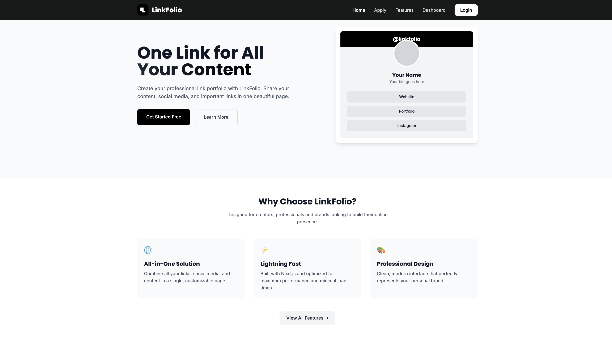
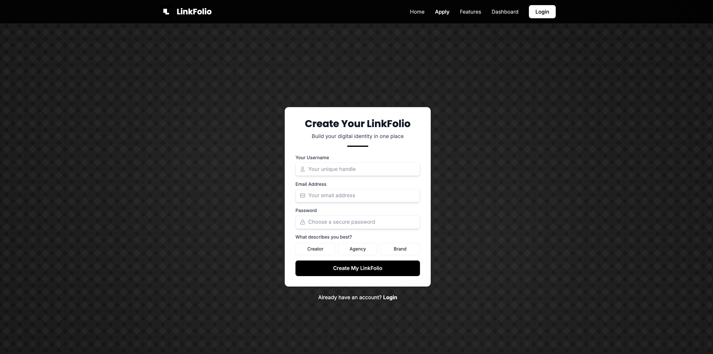
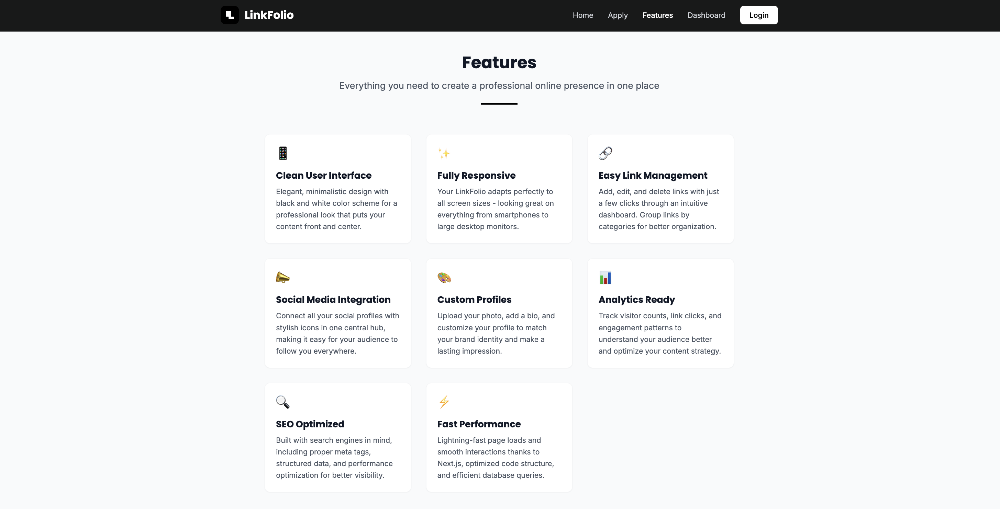
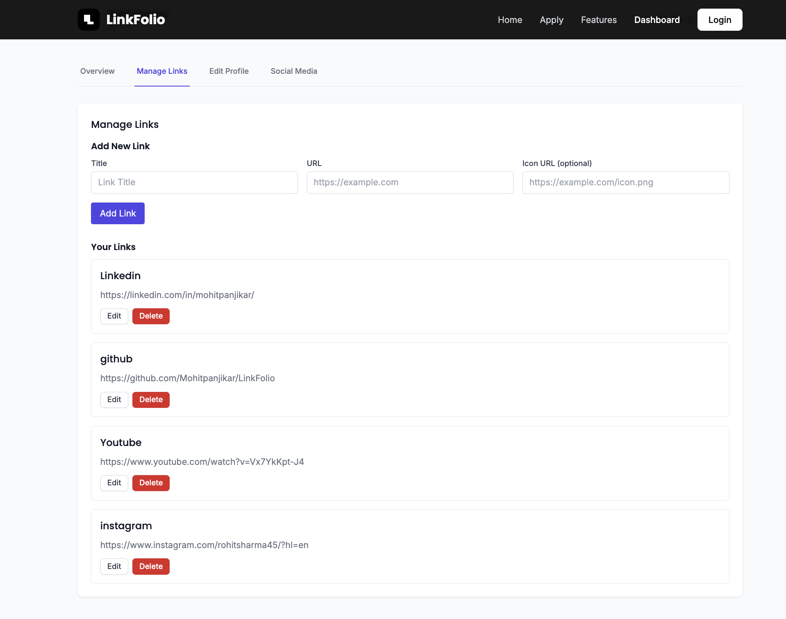
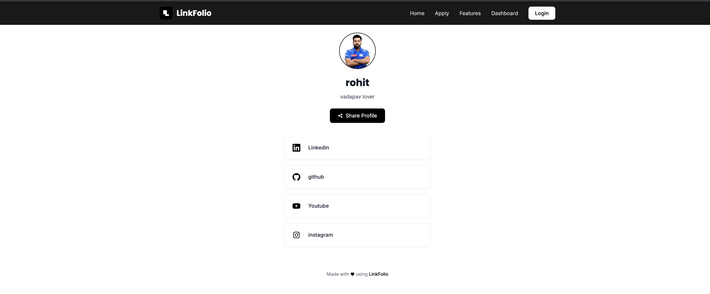

# LinkFolio ⛓️‍💥

<div align="center">
  
  <p><em>LinkFolio Home Page - Modern, Minimal, Black & White Design</em></p>
</div>

Welcome to **LinkFolio** – A modern, minimalist link-in-bio solution built with the MERN stack (MongoDB, Express, React, Node.js) and Next.js. This platform allows users to create their own customizable profile page with links to their social media, portfolio, products, or any other online content they want to showcase in one place.

## 📚 Concept Used - 

- **Setting up the Development Environment**: Install and configure MongoDB, Express, React, Node.js, and Next.js.
- **Building the Backend**: Create RESTful APIs with Express and manage data with MongoDB.
- **Developing the Frontend**: Craft a responsive and dynamic user interface with React and Next.js.
- **Integrating the Components**: Connect the backend with the frontend to create a seamless full-stack application.
- **Deploying the Application**: Learn how to deploy your application to a hosting service.

## 📸 Screenshots

<table>
  <tr>
    <td width="50%">
      
      <p align="center">Login Page</p>
    </td>
    <td width="50%">
      
      <p align="center">Features Page</p>
    </td>
  </tr>
  <tr>
    <td width="50%">
      
      <p align="center">User Dashboard</p>
    </td>
    <td width="50%">
      
      <p align="center">User Profile Page</p>
    </td>
  </tr>
</table>

## 🚀 Features

- **User Authentication**: Secure registration and login system with JWT
- **Customizable Profile**: Personalize your profile with avatar, bio, and custom handle
- **Link Management**: Add, edit, delete, and organize your important links
- **Social Media Integration**: Connect your social profiles automatically
- **Responsive Design**: Clean black and white interface that works on all devices
- **Automatic Icon Detection**: Smart recognition of platform icons based on URLs
- **Analytics Ready**: Built with future tracking capabilities in mind
- **Share Options**: Simple options to share your profile with others

## 🛠️ Tech Stack

- **Frontend**: Next.js, React.js, TailwindCSS
- **Backend**: Node.js, Express.js
- **Database**: MongoDB
- **Authentication**: JWT (JSON Web Tokens)
- **Deployment**: Vercel (Frontend), Heroku/MongoDB Atlas (Backend)

## 💻 Getting Started

### Prerequisites

- Node.js (v14.0.0 or later)
- MongoDB (local or Atlas)
- npm or yarn

### Installation

1. **Clone the Repository**:
   ```bash
   git clone https://github.com/your-username/linkfolio.git
   cd linkfolio
   ```

2. **Set up the Frontend**:
   ```bash
   cd Site
   npm install
   ```

3. **Set up the Backend**:
   ```bash
   cd ../server
   npm install
   ```

4. **Configure Environment Variables**:
   
   Create `.env` files in both the `Site` and `server` directories based on the provided examples.

5. **Run the Application**:

   Start the backend server:
   ```bash
   cd server
   npm start
   ```

   Start the frontend development server:
   ```bash
   cd Site
   npm run dev
   ```

   The frontend will be available at `http://localhost:3000` and the backend at `http://localhost:8080`.

## 🌐 Project Structure

```
linkfolio/
├── Site/                 # Next.js frontend
│   ├── components/       # Reusable React components
│   ├── pages/            # Next.js pages
│   ├── public/           # Static assets
│   └── styles/           # CSS and style files
│
├── server/               # Express.js backend
│   ├── controllers/      # Route controllers
│   ├── models/           # MongoDB schema models
│   ├── routes/           # API routes
│   └── middleware/       # Custom middleware
│
└── Demo/                 # Screenshots and demo materials
```

## 🤝 Contributing

Contributions are welcome! Please feel free to submit a Pull Request.

1. Fork the repository
2. Create your feature branch (`git checkout -b feature/amazing-feature`)
3. Commit your changes (`git commit -m 'Add some amazing feature'`)
4. Push to the branch (`git push origin feature/amazing-feature`)
5. Open a Pull Request

## 📄 License

This project is licensed under the MIT License - see the [LICENSE](LICENSE) file for details.

## 👨‍💻 Author

- **Mohit Panjikar** - [GitHub](https://github.com/your-github-username)

## 🙏 Acknowledgements

- [TailwindCSS](https://tailwindcss.com/) for the styling
- [Next.js](https://nextjs.org/) for the frontend framework
- [MongoDB](https://www.mongodb.com/) for the database
- [Express.js](https://expressjs.com/) for the backend framework
- All contributors who helped to make this project better

---

<p align="center">Made with ♥ using LinkFolio</p>
